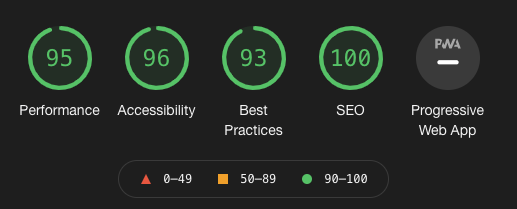
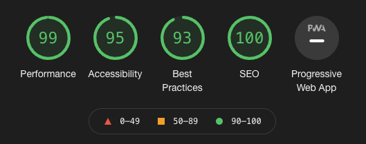

 
 

# adamj.github.io
A repo for my own personal site, hosted on GitHub.

This site uses CSS Grid, CSS Variables, and basic PWA functionality.

Releases are done via the [release-drafter](https://github.com/marketplace/actions/release-drafter) GitHub Action, with site builds performed by [Netlify](https://www.netlify.com).

----
## Licensing

[Font Awesome](https://fontawesome.com/) icons licensed under [Creative Commons Attribute 4.0 International license](https://fontawesome.com/license)

[Simple Icons](https://github.com/simple-icons/simple-icons) licensed under [CC0 1.0 Universal](https://github.com/simple-icons/simple-icons/blob/develop/LICENSE.md)

----
## Lighthouse Scores:
_as of 29 January, 2021_

### Desktop

- [Audit Report](Audit-desktop_report.json)

### Mobile

- [Audit Report](Audit-mobile_report.json)

**Progressive Web App: Optimized**
  - Users will not be prompted to install my site on their device
  - The site does not work offline
  - I do not use push notifications
