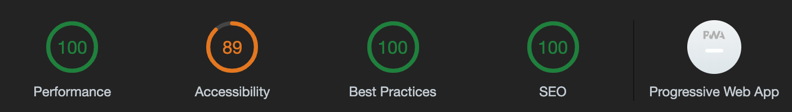
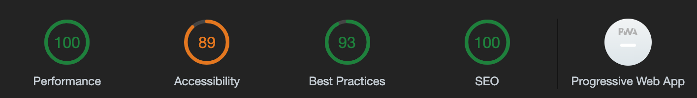

# Mindreeper2420.github.io
A repo for my own personal site, hosted on GitHub.

This site uses CSS Grid, CSS Variables, and basic PWA functionality.

I've configured the build to run using both travis-ci and azure-devops.

Changelog updated using [github-changelog-generator](https://github.com/github-changelog-generator/github-changelog-generator)

Lighthouse Scores:
 - Desktop
 
  [Report](Audit-desktop_report.json)
 - Mobile
 
 [Report](Audit-mobile_report.json)

- Performance: 100/100
- Progressive Web App: Optimized
  - Users will not be prompted to install my site on their device
  - The site does not work offline
  - I do not use push notifications
- Accessibility: 90
- Best Practices: 100/93
- SEO: 100/100

** scores are not guaranteed to be up-to-date
