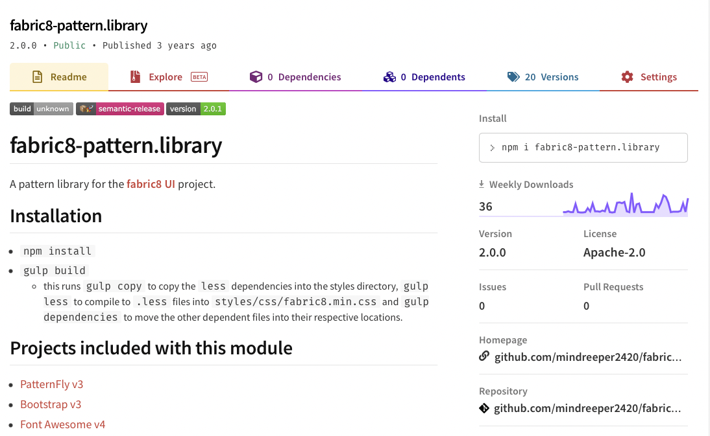

  

    

      

        

          <h2 class="my-5 display-6 lh-1 fw-bold text-center text-shadow-1">Red Hat Developer Design Manual</h2>
          <ul class="d-flex list-unstyled mt-auto">
            <li class="me-auto">
              <i class="bi bi-link-45deg"></i>
              <a href="https://aj-design-manual.netlify.app" target="top" alt="Design Manual demo" class="card-link">
                <small>Demo</small>
              </a>
            </li>
            <li>
              <i class="bi bi-github"></i>
              <a href="https://github.com/AdamJ/design-manual" target="top" alt="Design Manual on GitHub" class="card-link">
                <small>GitHub</small>
              </a>
            </li>
          </ul>
        

      

    

    

      

        

          <h2 class="my-5 display-6 lh-1 fw-bold text-center text-shadow-1">PatternFly.org</h2>
          <ul class="d-flex list-unstyled mt-auto">
            <li class="me-auto">
              <i class="bi bi-link-45deg"></i>
              <a href="https://pf4testbench.netlify.app" target="top" alt="Design Manual demo" class="card-link">
                <small>Demo</small>
              </a>
            </li>
            <li>
              <i class="bi bi-github"></i>
              <a href="https://github.com/AdamJ/pf4website" target="top" alt="Design Manual on GitHub" class="card-link">
                <small>GitHub</small>
              </a>
            </li>
          </ul>
        

      

    

    

      

        

          <h2 class="my-5 display-6 lh-1 fw-bold text-center text-white text-shadow-1">kubevirt.io</h2>
          <ul class="d-flex list-unstyled mt-auto">
            <li class="me-auto">
              <i class="bi bi-link-45deg"></i>
              <a href="https://kubevirtio-site.netlify.app" target="top" alt="KubeVirt.io demo" class="card-link">
                <small>Demo</small>
              </a>
            </li>
            <li>
              <i class="bi bi-github"></i>
              <a href="https://github.com/AdamJ/design-manual" target="top" alt="KubeVirt.io on GitHub" class="card-link">
                <small>GitHub</small>
              </a>
            </li>
          </ul>
        

      

    

    

      

        

          <h2 class="my-5 display-6 lh-1 fw-bold text-center text-white text-shadow-1">try.openshift.com</h2>
          <ul class="d-flex list-unstyled mt-auto">
            <li class="me-auto">
              <i class="bi bi-link-45deg"></i>
              <a href="https://try.openshift.com" target="top" alt="try.openshift site" class="card-link">
                <small>Demo</small>
              </a>
            </li>
          </ul>
        

      

    

    

      

        

          <h2 class="my-5 display-6 lh-1 fw-bold text-center text-shadow-1">fabric8-pattern.library</h2>
          <ul class="d-flex list-unstyled mt-auto">
            <li class="me-auto">
              <i class="bi bi-link-45deg"></i>
              <a href="https://www.npmjs.com/package/fabric8-pattern.library" target="_blank" alt="View library on npm" class="card-link">
                <small>NPM</small>
              </a>
            </li>
            <li>
              <i class="bi bi-github"></i>
              <a href="https://github.com/AdamJ/fabric8-pattern.library" target="_blank" alt="view library on GitHub" class="card-link">
                <small>GitHub</small>
              </a>
            </li>
          </ul>
        

      

    

    

      

        

          <h2 class="my-5 display-6 lh-1 fw-bold text-center text-shadow-1">Atom.io themes</h2>
          <ul class="d-flex list-unstyled mt-auto">
            <li class="me-auto">
              <i class="bi bi-link-45deg"></i>
              <a href="https://atom.io/users/mindreeper2420" target="_blank" alt="View themes on Atom.io" class="card-link">
                <small>Atom.io</small>
              </a>
            </li>
          </ul>
        

      

    

  

<!-- <h2 class="display-5 fw-bold lh-1">NPM packages</h2>

  

    
  

  

    <h2 class="display-6 lh-1 mb-3">fabric8-pattern.library</h2>
    
This package was created for a project that I worked on where having as few packages to install and maintain was a priority. The fabric8 pattern library combines PatternFly 3, Bootstrap 3, and Font Awesome 4 into a single consumable, usable with Webpack, Gulp, CSS Preprocessors or directly in HTML.

    

      <a href="https://www.npmjs.com/package/fabric8-pattern.library" class="btn btn-outline-primary px-4 me-md-2" target="_blank">View on npmjs.com <i class="bi bi-link"></i></a>
    

    

      
      

        <input class="form-control" style="font-family: 'Fira Mono', 'Andale Mono', 'Consolas', monospace; border: 1px #cccccc solid; padding: 6px;" type="text" value="npm i fabric8-pattern.library" placeholder="npm i fabric8-pattern.library" id="npmPackageInstall" disabled>
        <button type="button" class="btn btn-outline-dark" onclick="copyPackage()">Copy</button>
      

    

  

 -->
