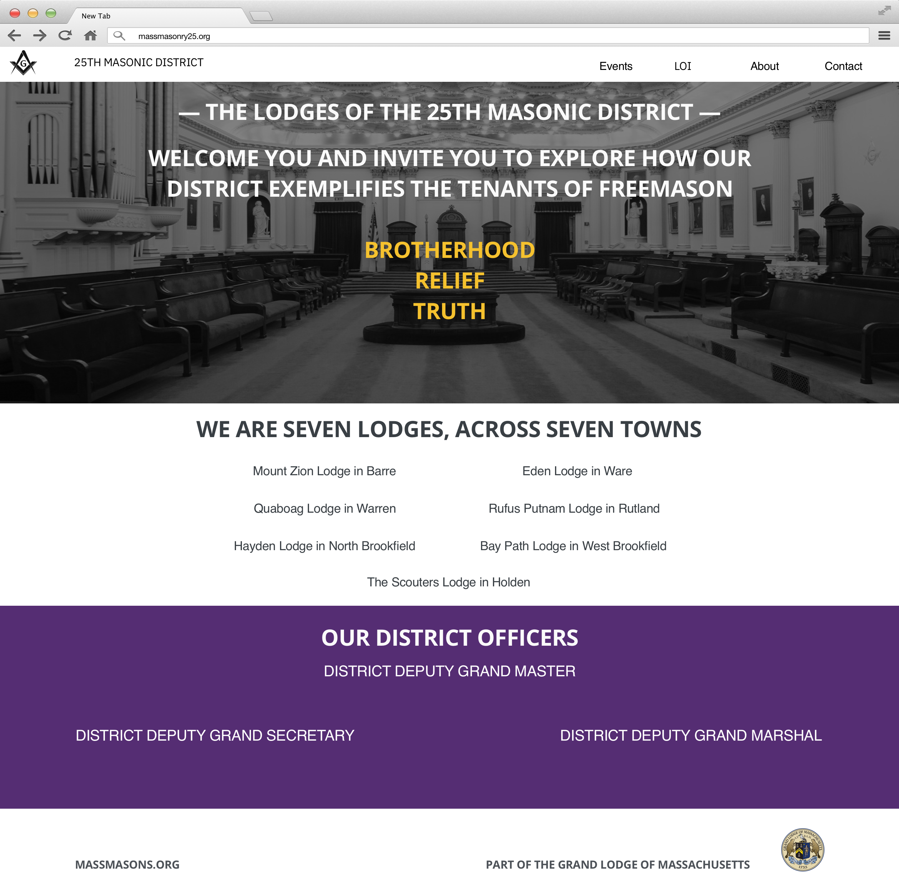
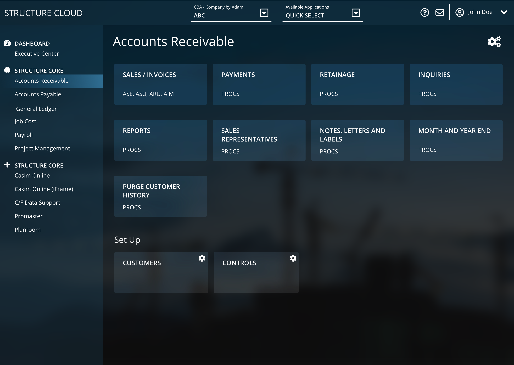
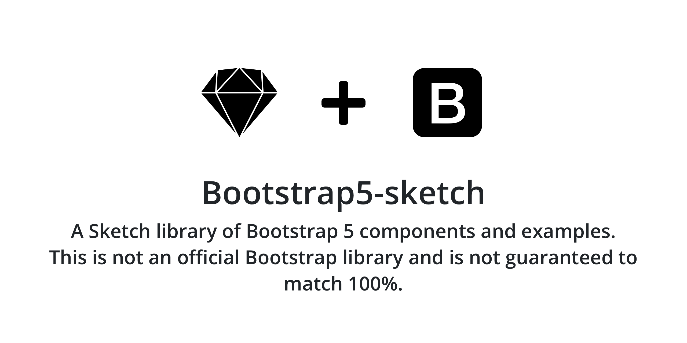

  

  <!--  -->
  

    

      
    

    

      <h2 class="display-6 fw-bold lh-1 mb-3">Switchback TimeTrak</h2>
      
The goal of this redesign was to create a simplistic system to easily access recent log entries, active projects, and team calendars. From this dashboard, users can quickly see these items, in addition to providing quick navigation items for in-depth reporting.

      <!-- 

        <a href="#" class="btn btn-secondary px-4 me-md-2">History</a>
      
 -->
    

  

  

    

      <h2 class="display-6 fw-bold lh-1 mb-3">District 25 website</h2>
      
The members of the 25th District reached out to me to update their outdated design with something new and clean that would draw new users in, while also quickly and easily displaying information that existing users consistently want to access. Through this process, I worked with the leadership committee to create a clean solution, while keeping a consistent feel across the platform.

      <!-- 

        <a href="#" class="btn btn-secondary px-4 me-md-2">History</a>
      
 -->
    

    

      
    

  

  

    

      
    

    

      <h2 class="display-6 fw-bold lh-1 mb-3">Structure</h2>
      
For this project, I was tasked with converting the UI of a COBOL application into something that would work with the modern web. The task was very challenging, in that one of the main requirements was to keep the layout as close to the original application as possible (in order to minimize the amount of relearning existing users would need to do), while also providing a clean UI that would attract new users to the platform.

      <!-- 

        <a href="#" class="btn btn-secondary px-4 me-md-2">Process</a>
      
 -->
    

  

  

    

      <h2 class="display-6 fw-bold lh-1 mb-3">Logos</h2>
      
From time to time, I'm asked to create a new logo or update an existing one. These can be based off of existing ideas or done from scratch. Here are a few examples.

      <!-- 

        <a href="#" class="btn btn-secondary px-4 me-md-2">Process</a>
      
 -->
    

    

      
      
      
    

  

  

    

      
    

    

      <h2 class="display-6 fw-bold lh-1 mb-3">Sketch libraries</h2>
      
From time to time, I will create a Sketch library for use in a given project. These are shared with the team, as well as online. I create these libraries when I know that a given project will either have a large number of components or have multiple designers working on it. This will ensure continuity between designs and a clear understanding of what is being done.

      

        <a href="https://github.com/AdamJ/Bootstrap5-sketch/releases" class="btn btn-outline-primary px-4 me-md-2">Download</a>
      

    

  

