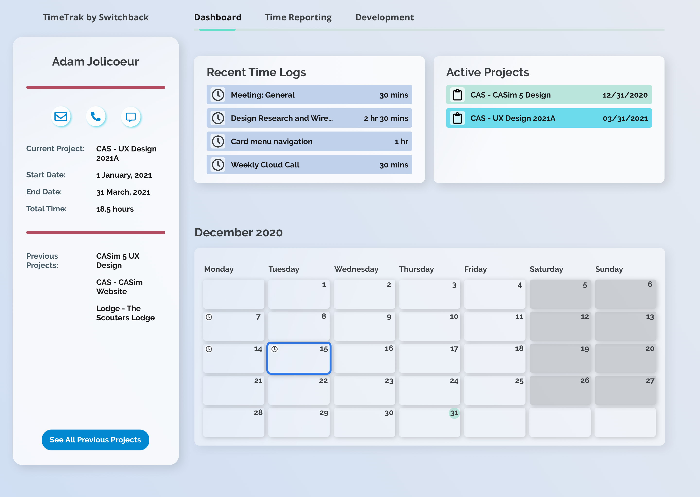

<!-- Application Lifecycle Management -->

  

    

      
    

    

      <h2>Application Lifecycle Management</h2>
      
A one-stop-shop for a team's planning and project lifecycle management.

      <a href="/designs/alm" role="button" class="btn btn-dark icon-link lead" alt="Click to experience the Application Lifecycle Management journey">
        the journey
      </a>
    

  

<!-- Customer Engagement Application -->

  

    

      <h2>Customer Engagement App</h2>
      
End-to-end tracking of customer engagement and marketing campaigns.

      <a href="/designs/customer-engagement" role="button" class="btn btn-dark icon-link lead" alt="Click to experience the Customer Engagement journey">
        the journey
      </a>
    

    

      
    

  

<!-- AdamJolicoeur.com redesign

  

    

      Coming soon!
    

    
    

      <h5 class="card-title">AdamJolicoeur.com</h5>
      
A redesign of my portfolio site with links to Figma designs, GitHub pull requests, and process write-ups (coming soon!).

    

    

      

        <a class="btn btn-secondary" role="button" href="https://www.figma.com/@adamj" target="top" alt="Link to my Figma community profile">
        <i class="fa-brands fa-figma"></i>
        Figma</a>
        <a class="btn btn-secondary" role="button" href="https://github.com/AdamJ/AdamJ.github.io/pull/234" target="top" alt="Link to GitHub pull request">
        <i class="fa-brands fa-github"></i>
        GitHub</a>
      

    

  

-->
<!-- Switchback TimeTrak and Structure Cloud -->

  

    

      <h2>Switchback TimeTrak</h2>
      
The goal of this redesign was to create a simplistic system to easily access recent log entries, active projects, and team calendars. From this dashboard, users can quickly see these items, in addition to providing quick navigation items for in-depth reporting.

      
    

    

      <h2>Structure Cloud</h2>
      
For this project, I was tasked with converting the UI of a COBOL application into something that would work with the modern web. The task was very challenging, in that one of the main requirements was to keep the layout as close to the original application as possible (in order to minimize the amount of relearning existing users would need to do), while also providing a clean UI that would attract new users to the platform.

      
    

  

<!-- Editor themes -->

  

    

      <h2>Environment themes</h2>
      
As one who likes to personalize their working environment, I look at creating themes for IDEs, my terminal environment, and Stream Deck board. If you can't enjoy the space you're in, why be in it?
      

      Inspired by the PatternFly design system, I created two libraries for use with Atom.io. As atom.io is no longer available, these themes are left to history.

    

  

  

    

      

        
        

          <h5 class="card-title">Atom.io PatternFly theme</h5>
        

      

    

    

      

        
        

          <h5 class="card-title">Atom.io PatternFly syntax</h5>
        

      

    

  

