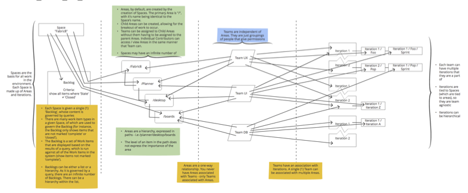
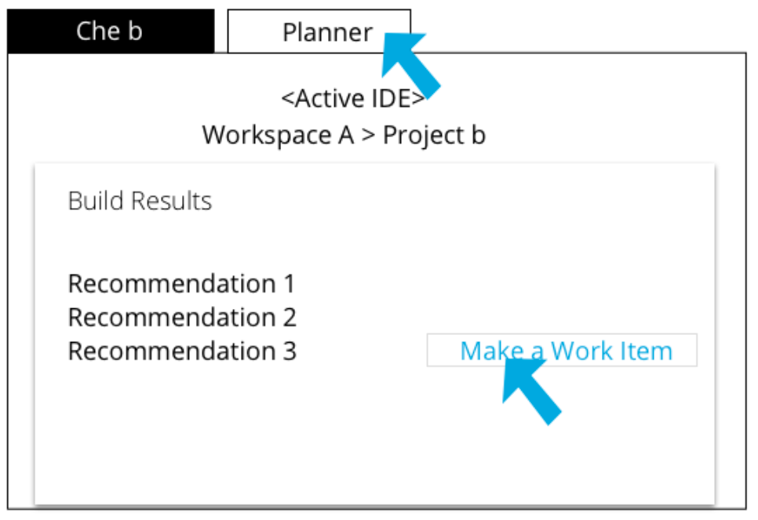
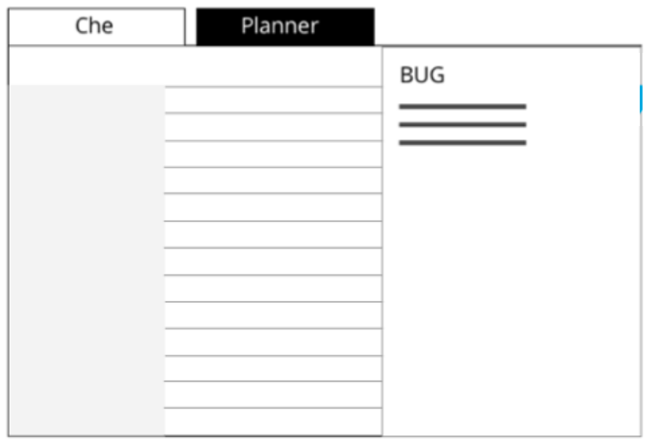
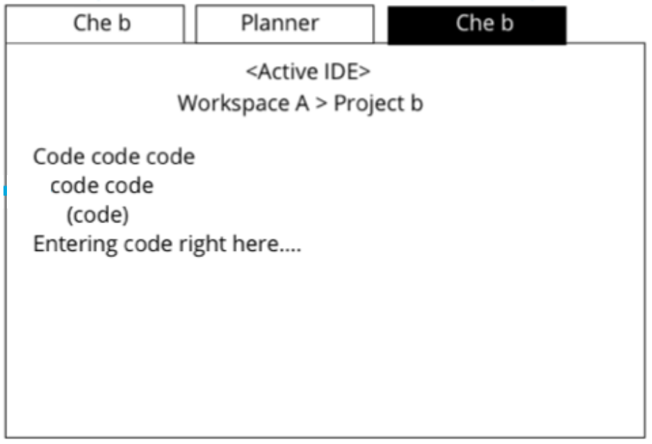
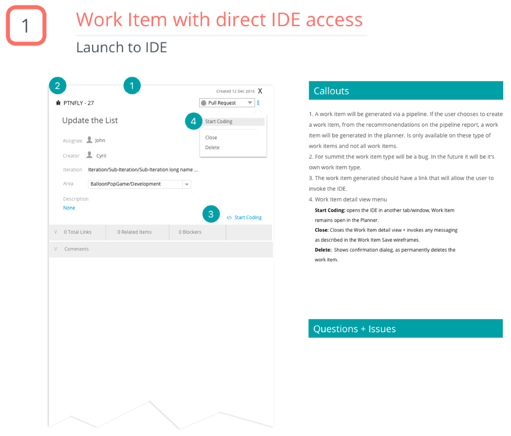
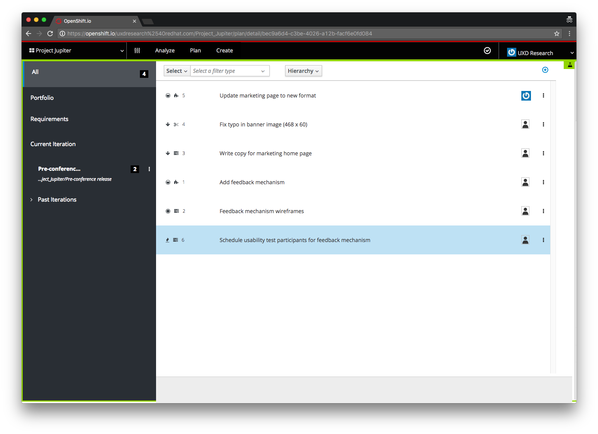

  <dl class="row">
    <dt class="col-sm-2">Role</dt>
    <dd class="col-sm-10">Interaction Designer, Prototypes</dd>
    <dt class="col-sm-2">Areas</dt>
    <dd class="col-sm-10">Wireframes, user paths, usability, prototyping</dd>
    <dt class="col-sm-2">Challenge</dt>
    <dd class="col-sm-10">The greater project team was using multiple project management tools, code repositories, and application development processes, with none of them talking to each other. This project takes all of those areas of concern and brings them together into a single, cohesive interface.</dd>
  </dl>
  

  <h2>The Process</h2>
  
Before starting on the Application Lifecycle Management project, it was determined that the following areas would be need to be covered: who are the target users, a user flow, wireframes, and, potential, prototypes for user testings and feasibility. 

  <h3>Target Users</h3>
  
Through discussions with Stakeholders and Project Management, it was decided that the target users would be set in tiers - <u>General Users</u> (those who need to add and interact with issues, update project assets, and interact daily - a mix of designers and developers); <u>Project Managers</u> (organizers of work, set deadlines and release dates), and <u>Administrators</u> (control any integrations, add-ons, and access).

  <h3>Application Lifecycle Management flow</h3>
  

  <h3>Wireframes and Workflows</h3>
  
For each section of the ALM application, workflows and wireframes were used to identify possible user paths, as well as to strategize initial designs before moving on to high fidelity mockups and prototypes.

  <h4>From Work Items to Development</h4>
  
<b>Goals:</b>
    <ul>
      <li>Communicates to the user that direct access to developing the Work Item is available in a single click.</li>
      <li>Implementation is unobtrusive and implies navigation.</li>
      <li>Location will not accidentally be clicked, allowing for enough real estate for line lengths and other meta data. The location of the integration should also imply moving forward.</li>
      <li>Ordered by recommendation - require users to fill in one area before moving on.</li>
      <li>As a button, it needs to have a prominent place yet not take the place of a primary button (in style).</li>
    </ul>
  

  <b>Steps to complete the process:</b>
  

    

      

        
        

          <h5 class="card-title">Step 1</h5>
          

            <ol>
              <li>I see a recommendation in the report.</li>
              <li>I click 'make a work item'.</li>
              <li>I navigate to the Planner to see/comment on the new work item.</li>
              <li>If the same recommendation is suggested during another build process, it will generate a new work. At this time, detection for duplicate items does not exist.</li>
            </ol>
          

        

      

      

        
        

          <h5 class="card-title">Step 2</h5>
          

            <ol>
              <li>I see a recommendation in the report.</li>
              <li>I click 'make a work item'.</li>
              <li>I navigate to the Planner to see/comment on the new work item.</li>
              <li>If the same recommendation is suggested during another build process, it will generate a new work. At this time, detection for duplicate items does not exist.</li>
            </ol>
          

        

      

      

        
        

          <h5 class="card-title">Step 3</h5>
          

            <ol>
              <li>I see a recommendation in the report.</li>
              <li>I click 'make a work item'.</li>
              <li>I navigate to the Planner to see/comment on the new work item.</li>
              <li>If the same recommendation is suggested during another build process, it will generate a new work. At this time, detection for duplicate items does not exist.</li>
            </ol>
          

        

      

    

  

  

    

      

        

          
        

        

          

            <h5 class="card-title">Card title</h5>
            
This is a wider card with supporting text below as a natural lead-in to additional content. This content is a little bit longer.

          

        

      

    

  

  
From these workflows and wireframes, it was determined that additional questions needed to be answered:
    <ul>
      <li>How do we handle accuracy between the linking of work items?</li>
      <li>If the work items has a fine name and line number, is the commit SHA also used to help identify the connection?</li>
      <li>Are we able to type the URL in a browser and navigate to the work item? (Does it have a unique link or is it randomly generated each time?)</li>
    </ul>
  

  <h3>Visual Design</h3>
  
After completing the wireframes and flows, a sample visual design was created. This design was created using the in-house design component library.

  

  <h3 class="mt-3">Prototyping</h3>
  
As part of the testing and usability study process, I created a prototype that demonstrated some of the basic layouts and IA for users to explore and provide feedback on. This process evolved over time and, eventually, became a full-fledged website that utilized static data and was continuously updated as users provided feedback.

  <a class="btn btn-outline-secondary" href="https://www.adamjolicoeur.com/testing_environment/index.html" target="top" alt="Link to prototype example">View prototype</a>

  

  

    
<h3>Final thoughts</h3>

    

      
In review, I believe that this process helped to flush out a great number of questions and concerns, while also demonstrating that their is a solid platform in which to build the full application on. The findings discovered through the process were taken to the Project Stakeholders, which were then used to create additional design stories and discussions with the development teams.

    

  

