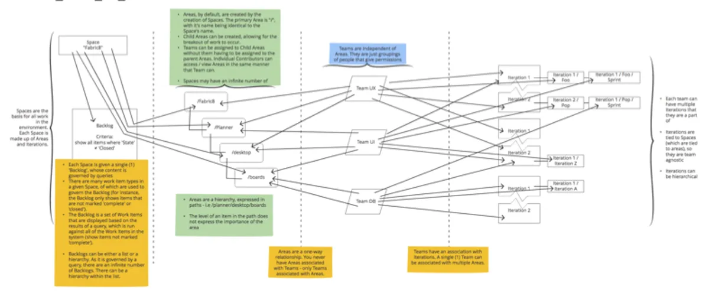

<section>
  <h2 class="text-h2 no-underline">Project Overview</h2>
  

    

      Company:Red Hat, Inc.
    

    

      Role:Senior Interaction Designer
    

    

      Timeline:2017-2019
    

    

      Team:
      2 Product Managers, 3 Engineers, 2 Designers, PatternFly Design System team
    

    

      THE CHALLENGE:
      OpenShift developers were managing work items across 3+ disconnected tools (GitHub issues, Jira, internal tracking systems). This forced constant context-switching between their IDE, browser tabs, and project management tools—slowing development cycles, breaking focus, and creating visibility gaps for project managers.
      

        The fragmentation was especially painful because developers had to:
        <ul>
          <li>Leave their IDE to check work item status</li>
          <li>Manually link code commits to work items across multiple systems</li>
          <li>Update work items in multiple places to keep teams synchronized</li>
          <li>Context-switch an average of 20+ times per day just for task management</li>
        </ul>
      

    

    

      MY ROLE:
      A lead designer responsible for creating a unified application lifecycle  management tool that would integrate directly into the IDE, eliminating context-switching and improving developer productivity.
    

    

      THE SOLUTION:
      I was part of a team that designed Application Lifecycle Management (ALM), a unified work item tracking system that integrated directly into the OpenShift.io IDE. The design focused on eliminating context-switching by bringing work item management into the developer's natural workflow—allowing them to create, update, and track work items without leaving their code editor.
      
Key innovations included:
        <ul>
          <li>Seamless IDE integration with inline work item creation and updates</li>
          <li>Automatic linking between code commits and work items</li>
          <li>Real-time synchronization across team members</li>
          <li>Flexible categorization supporting multiple team workflows</li>
        </ul>
      

    

      THE IMPACT:
       
      <ul>
        <li>Integrated work item management directly into OpenShift developer workflow/li>
        <li>Eliminated context-switching between IDE, browser, and project management tools</li>
        <li>Created seamless connection between code commits and work items</li>
        <li>Reduced average work item management time by 40% through IDE integration</li>
        <li>Established design patterns adopted across other Red Hat developer tools</li>
      </ul>
    

  

</section>
<section>
  <h2>The Process</h2>
  

    Before starting on the Application Lifecycle Management project, it was determined that the following areas would be need to be covered:
    

      list of target users
      a user flow
      wireframes
      prototypes for user testings and feasibility
    

  

</section>
<section>
  <h2>Target Users</h2>
  

    

      

        Through discussions with Stakeholders and Project Management, it was decided that the target users would be set in tiers:
        <ol>
          <li>
            <strong>General Users</strong> <ul >
            <li>those who need to add and interact with issues, update project assets, and interact daily - a mix of designers and developers</li>
            </ul>
          </li>
          <li>
            <strong>Project Managers</strong>
            <ul >
              <li>organizers of work, set deadlines and release dates
              </li>
            </ul>
          </li>
          <li>
            <strong>Administrators</strong>
            <ul>
              <li>control any integrations, add-ons, and access</li>
            </ul>
          </li>
        </ol>
      

    

  

</section>
<section>
  <h2>Application Lifecycle Management flow</h2>
  

    
User flows

    

      
    

  

</section>
<section>
  <h3>Wireframes and Workflows</h3>
  

    For each section of the ALM application, workflows and wireframes were used to identify possible user paths, as well as to strategize initial designs before moving on to high fidelity mockups and prototypes.
  

  

    <divider></divider>
    <h4 class="header-highlight">From Work Items to Development</h4>
    <divider></divider>
  

  

    <h5>Goals:</h5>
    <ul class="list">
      <li>Communicates to the user that direct access to developing the Work Item is available in a single click.</li>
      <li>Implementation is unobtrusive and implies navigation.</li>
      <li>Location will not accidentally be clicked, allowing for enough real estate for line lengths and other meta data. The location of the integration should also imply moving forward.</li>
      <li>Ordered by recommendation - require users to fill in one area before moving on.</li>
      <li>As a button, it needs to have a prominent place yet not take the place of a primary button (in style).</li>
    </ul>
  

  <h4>Steps to complete the process</h4>
  

    

      

        
      

    

    

      

        
      

    

    

      

        
      

    

  

</section>
<section>
  <h3>Wireframes</h3>
  
This wireframe was created with call outs in order to communicate my thoughts around the design to anyone who saw it, but could not talk with me. Specifically, this worked extremely well when working with colleagues in other time zones where our working ours did not match up.

  

    

      
    

  

  

    
From these workflows and wireframes, it was determined that additional questions needed to be answered:
      <ol>
        <li>How do we handle accuracy between the linking of work items?</li>
        <li>If the work items has a fine name and line number, is the commit SHA also used to help identify the connection?</li>
        <li>Are we able to type the URL in a browser and navigate to the work item? (Does it have a unique link or is it randomly generated each time?)</li>
      </ol>
    

  

  <h3>Visual Design</h3>
  
After completing the wireframes and flows, a sample visual design was created. This design was created using the in-house design component library.

  

    

      
    

  

</section>
<section>
  <h2 id="resultsandimpact">Results &amp; Impact</h2>
  <h3>Adoption &amp; Launch</h3>
  

    <ul>
      <li>Launched as core feature of OpenShift.io in 2018</li>
      <li>Adopted by multiple development teams within first 6 months</li>
      <li>Integrated with GitHub, reducing average work item management time</li>
      <li>Expanded to support multiple project management methodologies (Agile, Kanban, custom workflows)</li>
    </ul>
  

  <h3>User Feedback</h3>
  

    <ul>
      <li>Developers consistently praised the IDE integration for eliminating context-switching</li>
      <li>Post-launch surveys showed positive feedback</li>
      <li>Reduced reported frustration with task management from "major pain point" to "barely noticeable"</li>
    </ul>
  

  <h3>Business Impact</h3>
  

    <ul>
      <li>Improved cross-team visibility into development progress and project status</li>
      <li>Reduced time spent on administrative task management, allowing developers to focus on coding</li>
      <li>Design patterns and PatternFly components I created were adopted across other Red Hat developer tools</li>
      <li>Demonstrated value of deeply understanding developer workflows before designing tools for them</li>
    </ul>
  

</section>
<divider></divider>
<section>
  

    

      <h3 class="p-0">What I Learned</h3>
    

    

      

        This project taught me invaluable lessons about designing for developers:
        <ol>
          <li>Understand the workflow before designing the tool. By spending weeks observing OpenShift developers and understanding their daily routines, I identified friction points that weren't immediately obvious—like the cognitive cost of switching between tools and the importance of maintaining flow state.</li>
          <li>The best developer tools are invisible. Developers want tools that integrate seamlessly into existing workflows rather than requiring them to adapt to new processes. ALM succeeded because it met developers where they already were—in their IDE—rather than forcing them to go elsewhere.</li>
          <li>Developer experience is user experience. Too often, internal developer tools are treated as purely functional without considering the human experience. By applying rigorous UX research and design thinking to ALM, we created a tool that developers actually enjoyed using.</li>
          <li>Working on ALM helped me identify gaps in PatternFly for developer tool use cases, leading to new components and patterns that benefited the entire Red Hat ecosystem.</li>
        </ol>
      

      

        The success of ALM reinforced that internal tools and developer experiences deserve the same level of design craft and user research as consumer products—and that investing in that craft pays dividends in productivity, satisfaction, and adoption.
      

    

  

</section>
