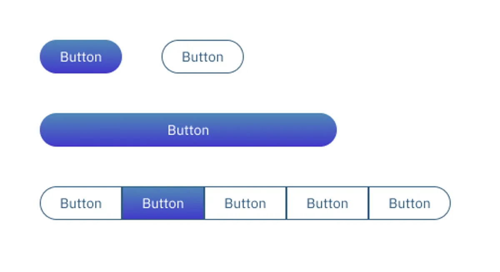
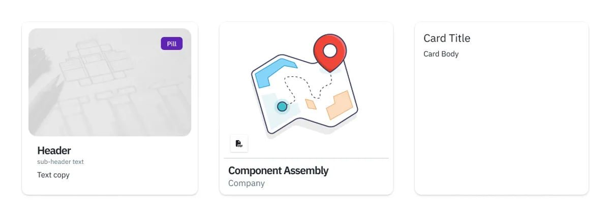
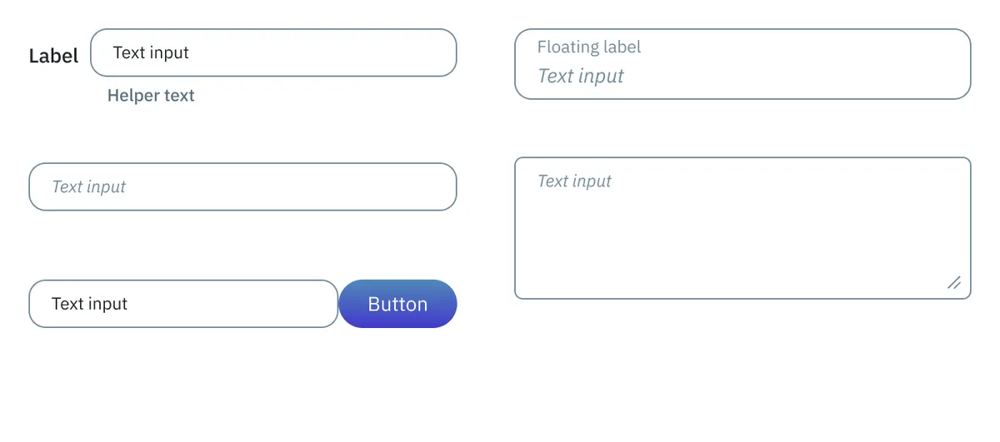

<section>
  <h2 class="text-h2 no-underline">Overview</h2>
  

    

      Built comprehensive design system for Component Assembly Systems' construction management platform, spanning web and iOS applications.
    

    
Created unified visual language, reusable components, and documentation that accelerated development cycles.

    

      Role:Lead Product Designer
    

    

      Timeline:2024-Present
    

    

      Platform:Web &amp; iOS
    

  </card>
</section>

<section>
  <h2 class="text-h2 no-underline">Design Tokens</h2>
  

    

      
Color Palette

      

        

          
        

      

    

    

      
Typography

      

        

          
        

      

    

  

  

    

      
Spacing &amp; Sizing

      

        <pre class="language-css">
        <code class="language-css">
  --cas-spacer-xxs: 0.25rem; /* 4px */
  --cas-spacer-xs: 0.5rem;   /* 8px */
  --cas-spacer-sm: 0.75rem;  /* 12px */
  --cas-spacer: 1rem;        /* 16px */
  --cas-spacer-md: 1rem;     /* 16px */
  --cas-spacer-lg: 1.25rem;  /* 20px */
  --cas-spacer-xl: 1.5rem;   /* 24px */
  --cas-spacer-xxl: 2rem;    /* 32px */
  --cas-spacer-xxxl: 3rem;   /* 48px */
        </code>
        </pre>
      

    

    

      
Iconography

      

        
      

    

  

</section>

<section>
  <h2 class="text-h2 no-underline">Components</h2>
  

    

      
Buttons

      

        
      

    

    

      
Cards

      

        
      

    

  

  

    

      
Data Tables

      

        
      

    

    

      
Forms, Inputs, Dropdowns

      

        

          
        

        

          
        

      

    

  

</section>
<section>
  <h2 id="storybook">Documentation</h2>
  
All design and component documentation was created using Storybook.
  

  

    

      
    

    

      <a href="https://main--6903b2381f768ce7c6da402a.chromatic.com" target="_blank" class="btn btn-link" alt="Visit the Storybook link">View Storybook</a>
    

  

</section>
<divider class="divider"></divider>
<section>
  

    

      <h3 class="p-0">Impact</h3>
    

    

      

        <ul>
          <li>Established first unified design system across web and iOS</li>
          <li>Reduced design-to-development handoff time by providing production-ready component specifications</li>
          <li>Created foundation for rapid feature development and consistent user experience</li>
          <li>Documented design tokens and usage guidelines for engineering team</li>
        </ul>
      

    

  

</section>
