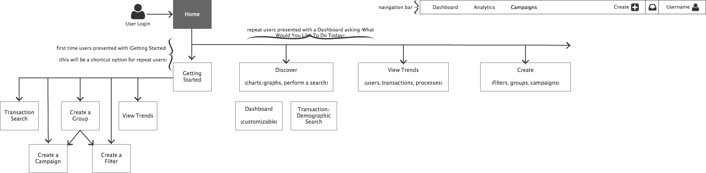
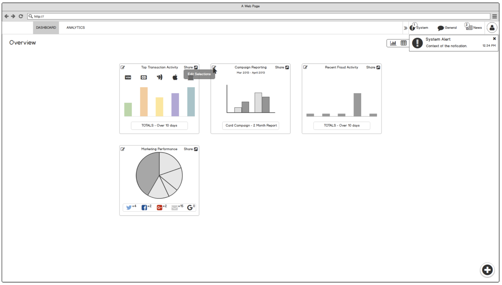
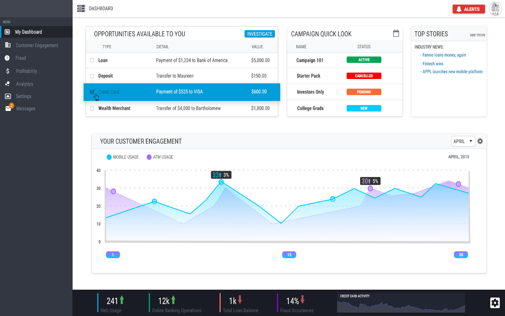
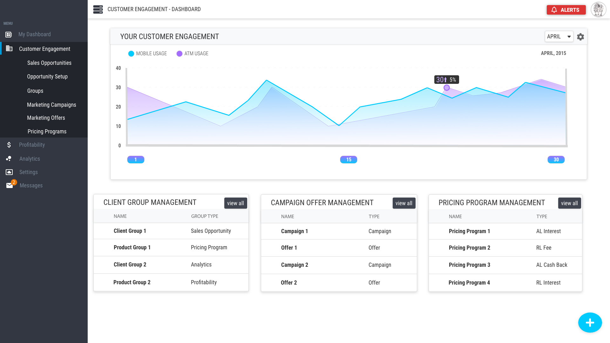
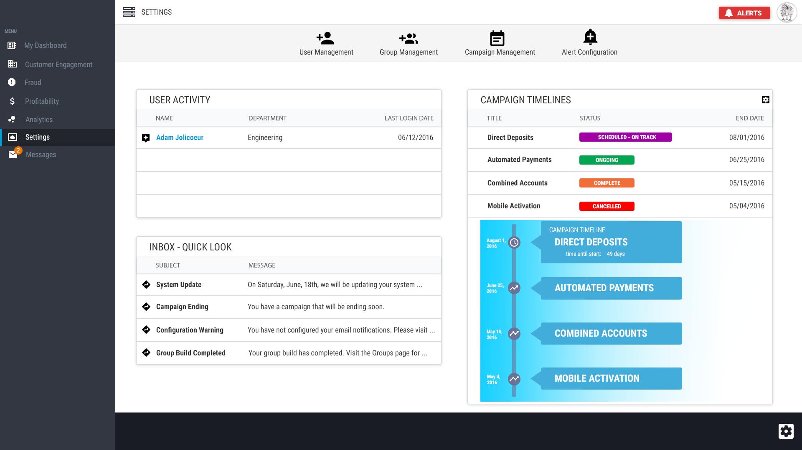
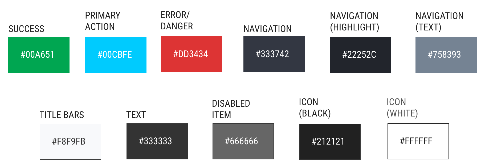
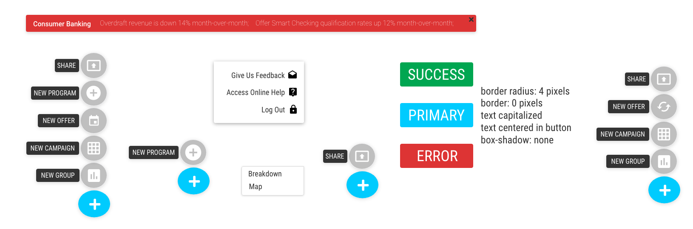
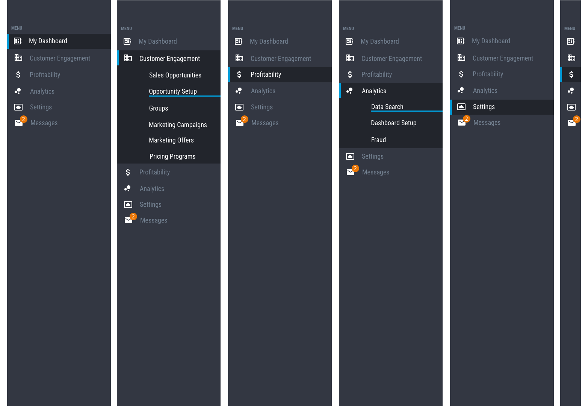

  <dl class="row">
    <dt class="col-sm-2">Role</dt>
    <dd class="col-sm-10">Interaction Designer, Visual Designer</dd>
    <dt class="col-sm-2">Areas</dt>
    <dd class="col-sm-10">Wireframes, Visual Designs</dd>
    <dt class="col-sm-2">Challenge</dt>
    <dd class="col-sm-10">For this project, I was tasked with updating an old user interface to increase usability and visual styling to match a more modern aesthetic.</dd>
  </dl>
  

  <h2>Goals</h2>
  
The goals of this project were to <i>improve</i> efficiency, <i>upgrade</i> the visual aesthetic, and <i>enhance</i> visual awareness.

  <h2>Sitemap (alpha)</h2>
  
Before starting on the updated design for the Customer Engagement App (CEA), I first took to creating an updated sitemap. This allowed me to set a basic path for users to navigate through the application, while also separating the pieces of the application into useful areas.

  

  <h2>Wireframes</h2>
  
I created a set of wireframes that could be quickly iterated on for presenting ideas to project stakeholders and other interested parties.

  

  <h2>Visual Designs</h2>
  
These visual designs are a small sampling of the final screens that were implemented as part of the completion of this project. The Dashboard, Reporting screen, and Settings page were considered the high-value items and contained the majority of the different components that would be used across the project. This set the baseline for future screens and allowed the development team to create a component library in which to build upon.

  

    

      

        <h2 class="text-center">Application Dashboard</h2>
        
      

    

    

      

        <h2>Engagement Reporting</h2>
        
      

    

  

  

    

      

        <h2 class="text-center">Settings</h2>
        
      

    

  

   
  
The color palette and simplified component examples were some of the first items created, in order to provide the development team with a baseline in which to build the environment from.

  

    

      

        <h2 class="text-center">Color Palette</h2>
        
      

    

    

      

        <h2>Component Examples</h2>
        
      

    

  

  

    

      

        <h2>Navigation</h2>
        
      

    

  

  

  

    
<h3>Final thoughts</h3>

    

      
I believe that the process used for this project, albeit different, fit within the framework given and met all of the requirements as laid out by the Project Management Team. In the end, a new interface was created that met all of the requirements and was based off of clear steps and proper research. Competitively, this new design met, and often surpassed, expectations when compared to what was in use prior to this project.

    

  

