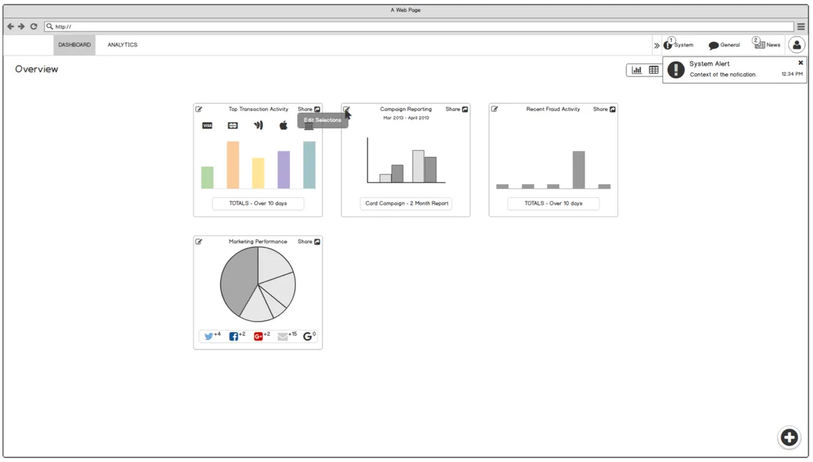
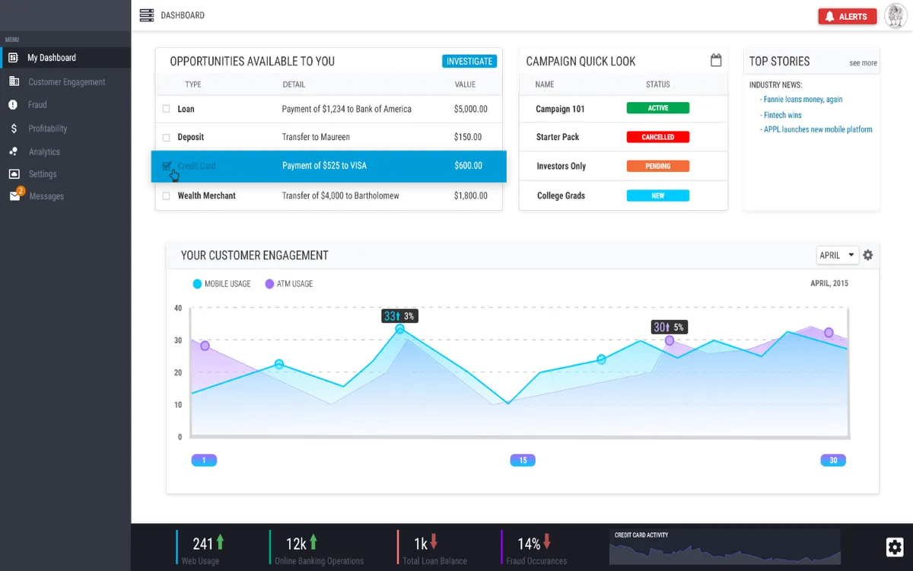
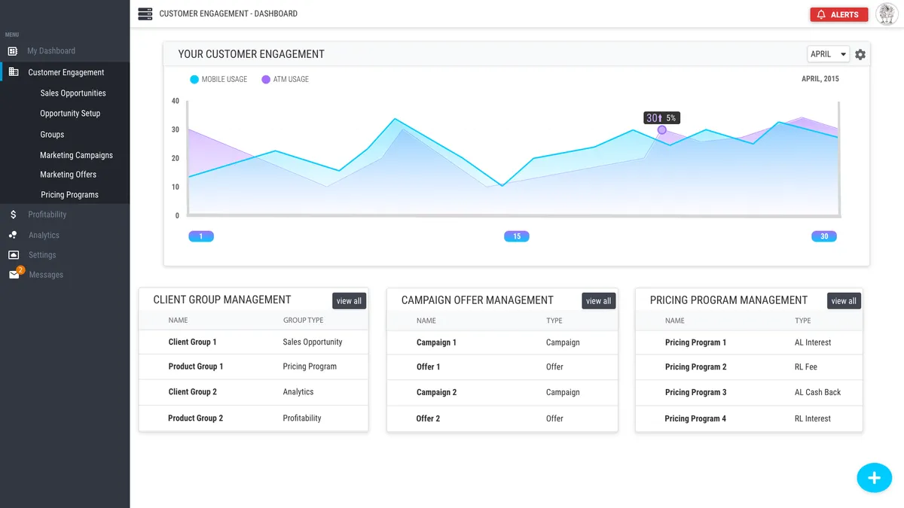
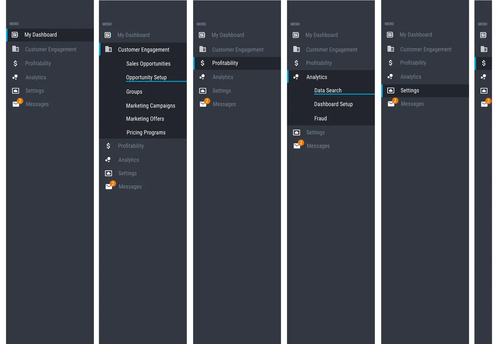

<section>
  <h2 class="text-h2 no-underline">Project Overview</h2>
  

    

      Company:Saylent Technologies
    

    

      Role:UX Designer (First in-house designer)
    

    

      Timeline:2014-2016
    

    

      Team:
      Solo designer collaborating with 2 Product Managers, 6 Engineers
    

    

      THE CHALLENGE:
      Saylent Technologies' Customer Engagement App (CEA) was a critical platform for credit unions and regional banks to track customer engagement and manage marketing campaigns. However, the existing interface was outdated, cluttered, and difficult to use—resulting in frustrated users and inefficient workflows.
      
The company needed a complete UX overhaul that would:
        <ul>
          <li>Modernize the visual aesthetic to match contemporary SaaS standards</li>
          <li>Improve usability and reduce time-to-complete common tasks</li>
          <li>Create a scalable design system for future product development</li>
          <li>Establish design processes and standards for the growing product team</li>
        </ul>
      

    

    

      THE SOLUTION:
      As Saylent's first in-house UX designer, I led a complete redesign of the Customer Engagement App from the ground up. I established user-centered design processes, conducted research with financial services users, and created a comprehensive design system that would serve as the foundation for all future Saylent products.
    

      THE IMPACT:
       
      <ul>
        <li>Reduced design-to-development time by 40% through reusable UI component library</li>
        <li>Improved user task completion efficiency through streamlined workflows</li>
        <li>Established design system adopted across multiple Saylent products</li>
        <li>Created first formal UX research and testing program at Saylent</li>
        <li>Set design standards that influenced company-wide product development</li>
      </ul>
    

  

</section>
<section>
  <h2 id="sitemapAlpha class="p-0">Sitemap (alpha)</h2>
  

    

      
Before starting on the updated design for the Customer Engagement App (CEA), I first took to creating an updated sitemap. This allowed me to set a basic path for users to navigate through the application, while also separating the pieces of the application into useful areas.

    

    

      
    

    

      
    

  

</section>
<section>
  <h2 id="wireframes" class="text-h2">Wireframes</h2>
  
I created a set of wireframes that could be quickly iterated on for presenting ideas to project stakeholders and other interested parties.

  

    

      
    

  

</section>
<section>
  <h2 class="text-h2">Visual Designs</h2>
  
These screens represent the high-value interfaces that contained the majority of components used throughout the application. By designing these first, I established visual patterns and interaction models that could be applied consistently across the entire product.

  <h3 class="mt-4 mb-3">Screens</h3>
  

    

      

        <h4 class="p-0">Customer Dashboard</h4>
      

      

        

          

            
          

        

        

          

            
The central hub where users monitor engagement metrics and campaign performance. Key design decisions included:
              <ul>
                <li>Clear visual hierarchy emphasizing most critical metrics</li>
                <li>Customizable widgets allowing users to personalize their view</li>
                <li>Quick access to common actions through prominent CTAs</li>
              </ul>
            

          

        

      

    

    

      

        <h4 class="p-0">Engagement Reporting</h4>
      

      

        

          

            
          

        

        

          

            
Comprehensive analytics interface for tracking campaign effectiveness and customer behavior. Design focused on:
              <ul>
                <li>Clean data visualizations emphasizing trends and insights</li>
                <li>Flexible filtering and date range selection</li>
                <li>Export functionality for sharing reports with stakeholders</li>
              </ul>
            

          

        

      

    

    

      

        <h4 class="p-0">Updates / Settings</h4>
      

      

        

          

            
          

        

        

          

            
Configuration interface for managing campaigns and user preferences. Prioritized:
              <ul>
                <li>Logical grouping of related settings</li>
                <li>Clear labels and helpful descriptions</li>
                <li>Inline validation and error prevention</li>
                <li>Confirmation dialogs for destructive actions</li>
              </ul>
            

          

        

      

    

  

</section>
<section>
  

    

      <h3 class="p-0">Color Palette</h3>
    

    

      
The color palette and simplified component examples were some of the first items created, in order to provide the development team with a baseline in which to build the environment from.

    

    

      
    

  

</section>
<section>
  <h2 id="componentExamples">Component Examples</h2>
  

    

      
    

    

      Asset examples including buttons, form elements, cards, and data visualization components.
    

  

</section>
<section>
  <h2 id="navigation">Navigation</h2>
  

    

      
    

  

</section>

<section>
  <h2 id="resultsandimpact">Results &amp; Impact</h2>
  

    <h3>Adoption &amp; Growth</h3>
    

      <ul>
        <li>Redesigned interface launched to all Saylent customers in Q3 2015</li>
        <li>Positive reception from existing users, with reduced support tickets</li>
        <li>Component library adopted as standard for all future product development</li>
      </ul>
    

    <h3>User Feedback</h3>
    

      <ul>
        <li>Post-launch usability testing showed marked improvement in task completion times</li>
        <li>Customer satisfaction scores increased following redesign</li>
        <li>Users consistently praised the "modern, professional" appearance</li>
        <li>Support team reported decrease in UI-related questions and confusion</li>
      </ul>
    

    <h3>Business Impact</h3>
    

      <ul>
        <li>Reduced design-to-development time by 40% through reusable component library</li>
        <li>Improved development team efficiency through clear design specifications</li>
        <li>Established design standards that accelerated development of additional products</li>
      </ul>
    

  

</section>

<section>
  

    

      <h3 class="p-0">What I Learned</h3>
    

    

      

        This project taught me invaluable lessons about establishing design practice at a growing company:
        <ol>
          <li><strong>Design systems pay dividends.</strong> The reduction in design-to-development time came directly from creating reusable, well-documented components. The upfront investment in building a component library saved countless hours on future projects.</li>
          <li><strong>Being the first designer means building infrastructure.</strong> Beyond just designing screens, I had to establish processes for user research, usability testing, design reviews, and design-dev collaboration. This foundational work enabled Saylent to scale its design practice as the team grew.</li>
          <li>Financial services <strong>users value clarity and confidence</strong>. Through research, I learned that our users prioritized clear labeling, logical workflows, and confirmation steps over flashy interactions.</li>
          <li><strong>Documentation is as important as the designs themselves.</strong> The component library was only valuable because it included clear usage guidelines, code snippets, and examples. This taught me that design deliverables must include the context engineers need to implement them correctly.
        </ol>
      

      

        The success of this redesign demonstrated the value of user-centered design at Saylent and paved the way for building a mature design practice at the company.
      

    

  

</section>

<section>
  

    

      <h3 class="p-0">Final thoughts</h3>
    

    

      
I believe that the process used for this project, albeit different, fit within the framework given and met all of the requirements as laid out by the Project Management Team. In the end, a new interface was created that met all of the requirements and was based off of clear steps and proper research. Competitively, this new design met, and often surpassed, expectations when compared to what was in use prior to this project.

    

  

</section>
<section>
  

    <a href="{{ '/designs/component-library/' | url }}" class="btn btn-outline btn-sm" alt="Navigate to component library case study">Previous Case Study</a>
  

</section>
