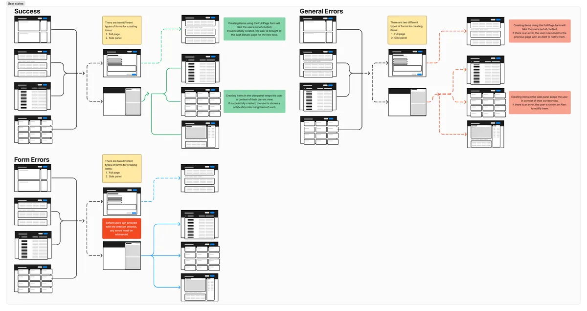

<section>
  <h2 class="text-h2 no-underline">Project Overview</h2>
  

    

      Company:Amazon Web Services
    

    

      Role:Senior UX Designer (Lead Designer)
    

    

      Timeline:2021-2023
    

    

      Team:
      Collaborated with 3 PMs, 8 engineers, UX researcher
    

    

      THE CHALLENGE:
      AWS teams were using 3-4 different task tracking tools (Jira, internal systems, spreadsheets), leading to fragmented workflows, poor cross-team visibility, and significant time wasted in context-switching. Product managers struggled to get a unified view of work across teams, and individual contributors were frustrated by having to update multiple systems.
    

    

      MY ROLE:
      I designed Task-it, a unified task management platform that consolidated these disparate tools into a single, intuitive system with role-agnostic patterns that could serve diverse AWS teams.
    

    

      THE SOLUTION:
      I designed Task-it, a unified task management platform that consolidated these disparate tools into a single, intuitive system. The design focused on role-agnostic patterns that could serve diverse AWS teams—from product managers tracking roadmaps to engineers managing technical debt to support teams triaging customer issues.
    

      THE IMPACT:
       
      <ul>
        <li>500 daily active users across 15+ AWS teams within 18 months of launch</li>
        <li>Consolidated 3-4 separate tracking systems into one unified platform</li>
        <li>Reduced context-switching and improved cross-team collaboration</li>
        <li>Drove feature roadmap through continuous user research and usability testing</li>
        <li>Created scalable UX patterns now being adopted in other AWS internal tools</li>
      </ul>
    

  

</section>
<section>
  <h2>The Process</h2>
  
Before any design work (wireframes, mockups, prototypes) could begin, extensive user research and testing was needed.

  

    
Research methods with example questions:
      <ol class="ml-4">
        <li class="mt-2"><strong>User interviews</strong>
          <ul class="ml-4">
            <li>Ask users what their role is on their product team.</li>
            <li>What product(s) do they use to manage their work?</li>
            <li>If they do not use the existing internal product, why not?</li>
          </ul>
        </li>
        <li class="mt-2"><strong>Competitive analysis</strong>
          <ul class="ml-4">
            <li>What products are used internally, besides the previous internal-built system?</li>
            <li>Why are they used? What do they provide that the current internal system does not?</li>
          </ul>
        </li>
        <li class="mt-2"><strong>On-hand testing</strong>
          <ul class="ml-4">
            <li>As a user, I needed to work within the system we were working to replace so that I can find the issues that currently exist.</li>
            <li>Findings were compared against user interviews. Those interviews were also used as a basis for various testing methods.</li>
          </ul>
        </li>
        <li class="mt-2"><strong>Observe users</strong>
          <ul>
            <li>Watch how users use the products: where do they always visit? What tasks are they always performing?</li>
          </ul>
        </li>
      </ol>
    

  

  

    
Once a baseline had been established, the first round of user flow diagrams and analysis took place. Each step in the various user flows had two goals:
      <ol class="ml-4">
        <li class="mt-2"><strong>Follow user expectations</strong>
          <ul class="ml-4">
            <li>Users expected to be able to perform basic tasks, such as creating work items, viewing work items, and organizing their work in a single system.</li>
          </ul>
        </li>
        <li class="mt-2"><strong>Simplify existing processes</strong>
          <ul class="ml-4">
            <li>Users would not accept a more complicated process. Interviews taught me that anything more complicated than what they had would be a deal-breaker for switching to, no matter the directives from management.</li>
          </ul>
        </li>
      </ol>
    

  

</section>
<section>
  <h2 id="targetaudience">Target Audience</h2>
  
For the initial release (scoped internally as a "beta"), the target audience consisted of Individual Contributors (IC), with a mix of high-interaction and low-interaction users. These were categorized as <strong>1. Contributors</strong>, <strong>2. Owners</strong>, and <strong> 3. Viewers</strong>.

  

    <ol class="ml-4">
      <li><strong>Contributor</strong>
        <ul class="ml-4">
          <li>Those who actively added items to a team's task queue.</li>
        </ul>
      </li>
      <li><strong>Owner</strong>
        <ul class="ml-4">
          <li>Individuals who were, at a high-level, responsible for the delivery and success daily and long-term tasks and goals. While not ICs, <strong>Owners</strong> had a direct hand in what tasks teams took on.</li>
        </ul>
      </li>
      <li><strong>Viewer</strong>
        <ul class="ml-4">
          <li>Those who stayed on the "outside" of the day-to-day operations, but could influence the work taking place. <strong>Viewers</strong> were not considered to be a top-level user, but the entire process had to take into account their work. If things became harder for them to see/find, then they were likely to become a blocker to adoption.</li>
        </ul>
      </li>
    </ol>
  

  
After discussions with Project Management (PM), it was determined that the target audience would be broken down into tiers: <strong>Tier 1</strong> and <strong>Tier 2</strong>.
  

  

    <ol class="ml-4">
      <li>
        <strong>Tier 1</strong> consisted of those who used the existing solutions multiple times per day and could assist with driving adoption. These were the <u>Contributors</u>.
      </li>
      <li>
        <strong>Tier 2</strong> consisted of those who interactive with existing solutions on a weekly basis, and then only to monitor the work being done by those in Tier 1.
      </li>
    </ol>
  

</section>
<section>
  <h2 id="userflows">User flows, Wireframes, and Mockups</h2>
  
For the initial Task Details view, user flows and wireframes were used to identify possible errors. The findings from this work would go on to determine the direction of the final mockups.

  

    
User flows

    

      <figure class="figure">
        
      </figure>
    

  

  

    
User states

    

      <figure class="figure">
        
      </figure>
    

  

</section>
<section>
  <h2 id="initialfindings">Initial findings</h2>
  
Based off of these user flows, I determined that the success and failures paths needed to be looked at further. Depending on the user, these paths had the potential to break experiences and decrease the usability and delight in the product.

  <h3 class="mt-4 mb-2">Wireframes</h3>
  
When creating wireframes, I start by taking an existing components (whether already in the application or from the component library in use) and lay out my page. From there, I begin to add some details (using the <code>redacted script</code> font) and basic headings. This is then reviewed with PM, Development, and, if available, fellow UX designers.

  <h3 class="mt-4 mb-2">Mockups</h3>
  
After reviews have been completed on the wireframes, mockups are created. In my process, I utilize mockups to get the full look/feel of the page without interactions. Once completed, these are used for user testing as well as final review with the development team.

  

    

      
Wireframe

      

        
      

    

    

      
Mockup

      

        
      

    

  

</section>
<section>
  <h2 id="testingandrevisions">Testing and Revisions</h2>
  
As part of the <strong>iterative</strong> process, I consistently looked at user feedback and heat-mapping to determine if there were any changes needed. From the beginning, it was known that additional attributes would be made available to users and that the Task Details page would have to be able to adapt accordingly.

  
As part of the <strong>testing</strong> process, I created a card-sorting survey for users, where I included all of the existing attributes, as well as some future-planned attributes, and asked users to order them by priority. Priority was determined by the user, with the only prompt being "what attribute(s) are required for you to get your work done in the most efficient manner?".

  

    
User Survey

    

      
    

  

  <h3 class="mt-4 mb-2">Revisions</h3>
  

    After analyzing the results of the card-sorting user testing, additional mockups were created to task with the updated attribute priorities.
  

  

    

      
Revision 1

      

        
      

    

    

      
Revision 2

      

        
      

    

    

      
Revision 3

      

        
      

    

  

</section>
<section>
  <h2 id="resultsandimpact">Results &amp; Impact</h2>
  <h3>Adoption &amp; Growth</h3>
  

    <ul>
      <li>Launched to pilot teams in Q2 2022, reaching general availability by Q4 2022</li>
      <li>Grew from 50 pilot users to 500 daily active users within 18 months</li>
      <li>Expanded across multiple AWS teams spanning product, engineering, and support organizations</li>
      <li>Achieved organic growth through word-of-mouth recommendations from satisfied users</li>
    </ul>
  

  <h3>User Feedback</h3>
  

    <ul>
      <li>Post-launch usability testing showed a high satisfaction rate with overall experience</li>
      <li>Users consistently praised the unified view: "Finally, one place to see all my work"</li>
      <li>Engineers appreciated the flexible categorization: "Task-it adapts to how I work, not the other way around"</li>
      <li>Product managers valued cross-team visibility: "I can finally see what's blocked across all my teams"</li>
    </ul>
  

  <h3>Business Impact</h3>
  

    <ul>
      <li>Consolidated 3-4 legacy tools, reducing tool sprawl and maintenance overhead</li>
      <li>Improved cross-team visibility into project status, blockers, and dependencies</li>
      <li>Reduced onboarding time for new AWS employees (one tool to learn instead of multiple)</li>
      <li>Established design patterns now being adopted in other AWS internal applications</li>
      <li>Demonstrated value of user-centered design for internal tools</li>
    </ul>
  

</section>
<divider></divider>
<section>
  

    

      <h3 class="p-0">What I Learned</h3>
    

    

      

        This project reinforced three critical lessons about designing internal tools:
        <ol>
          <li>Internal tools deserve the same design rigor as customer-facing products. By investing in proper user research, prototyping, and testing, we created a tool that users actually wanted to use—driving organic adoption without mandates from leadership.</li>
          <li>Flexibility beats rigid workflows. Rather than forcing all teams into a single process, we designed role-agnostic patterns that could adapt to different team structures and workflows. This flexibility was key to achieving broad adoption across diverse AWS organizations.</li>
          <li>Continuous research is essential. By conducting regular usability tests and gathering feedback throughout development, we caught issues early and built features that users actually needed—not just what we assumed they wanted.</li>
        </ol>
      

      

        The success of Task-it demonstrated that internal tools can be delightful and that investing in UX research pays dividends in adoption, productivity, and user satisfaction.
      

    

  

</section>
