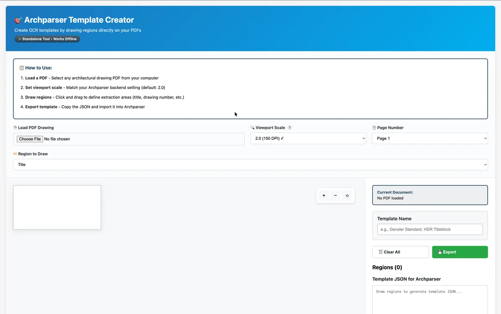
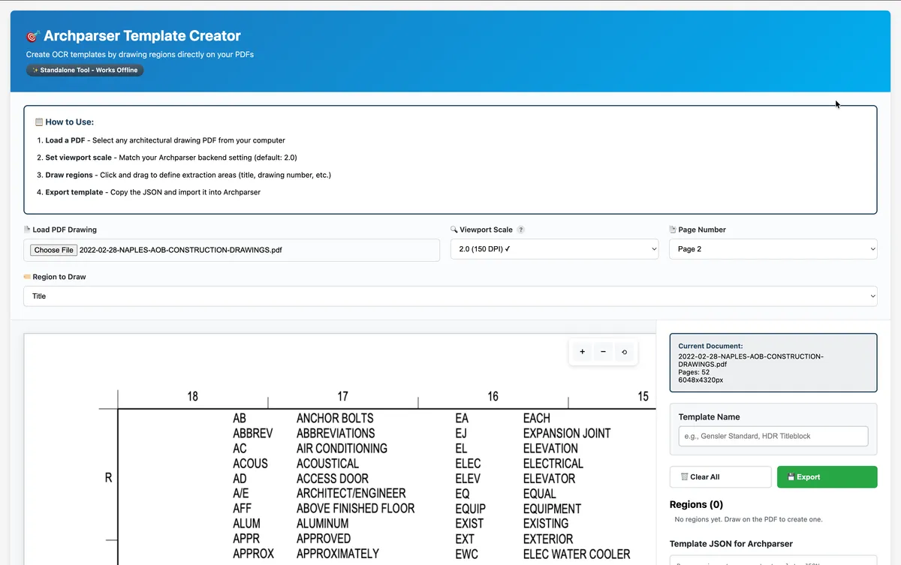
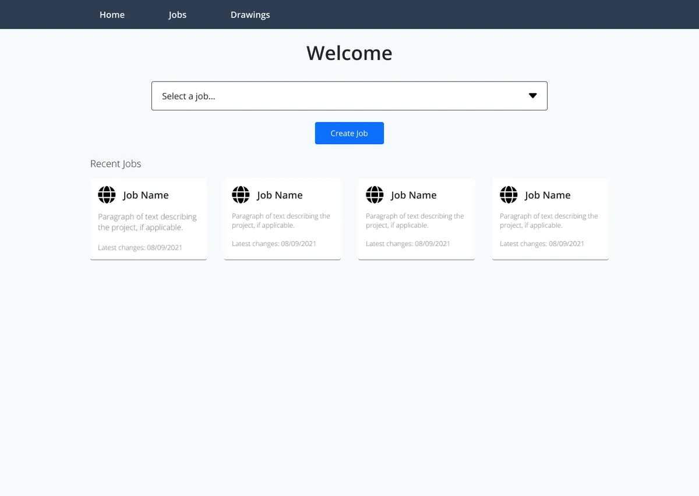
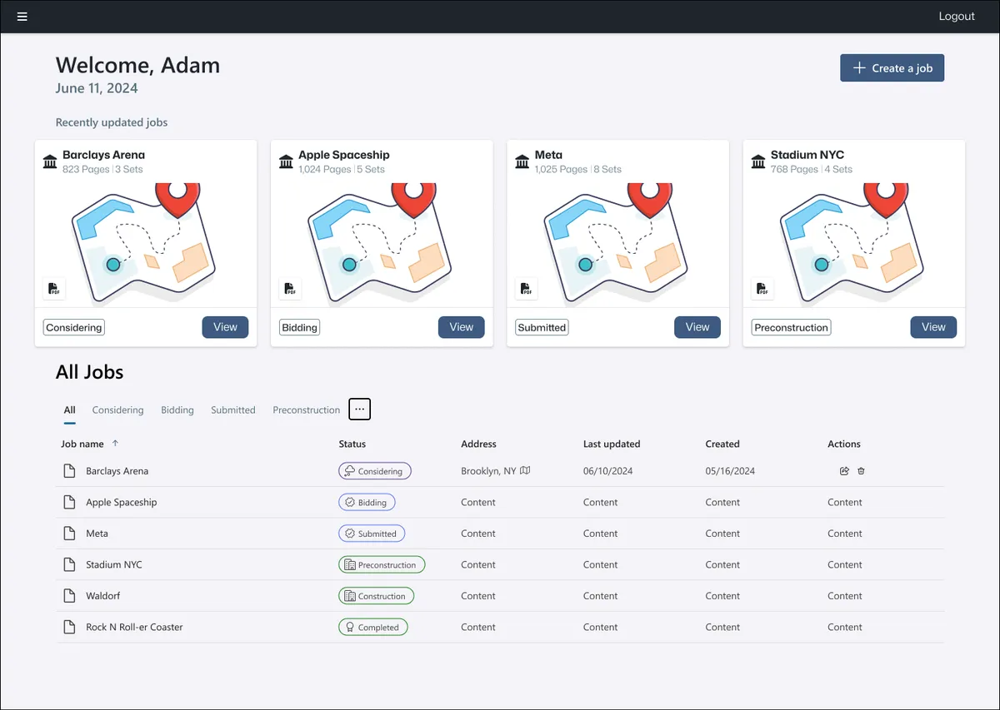
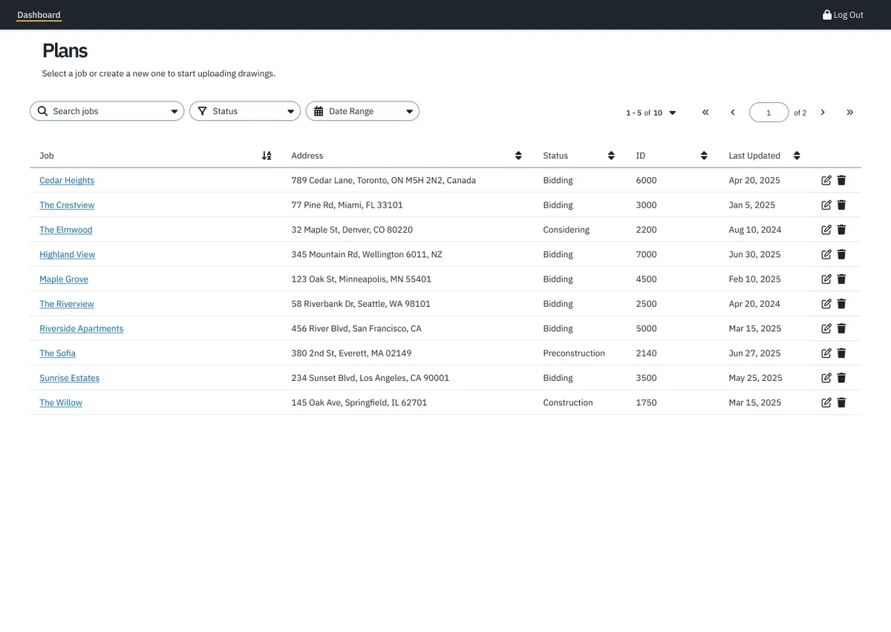
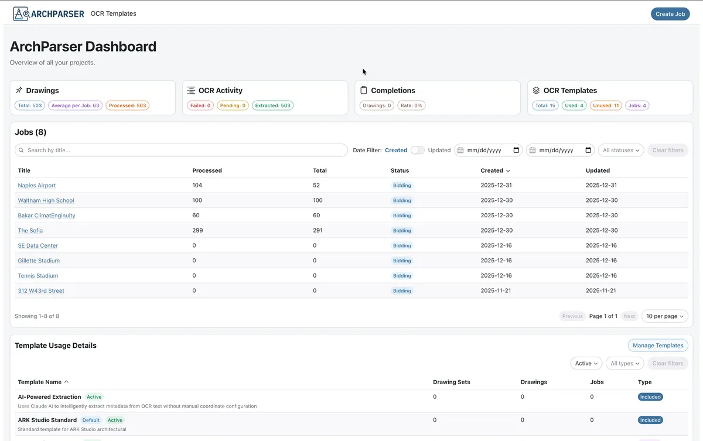
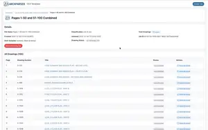
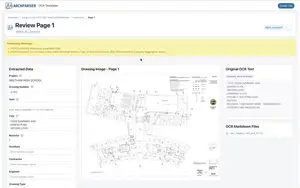

<section>
  <h2 class="text-h2 no-underline">Project Overview</h2>
  

    

      Role:Product Designer &amp; Full-Stack Developer
    

    

      Type:Personal Project (originally intended as a CAS tool)
    

    

      Stack:TypeScript monorepo, NestJS, React, RadixUI, MySQL, Tesseract.js, built with Claude Code
    

    

      Status:Demo-ready, paused while higher-priority CAS projects took precedence
    

  

  
Construction project managers at Component Assembly Systems needed to pull metadata from hundreds of architectural drawing PDFs. Entering drawing numbers, revision dates, and project names from title blocks by hand was slow, error-prone, and impossible to sustain on 500+ page sets, and no existing tool handled custom title block layouts across different architectural firms. I interviewed project planners and managers about their workflows, then designed and built ArchParser to automate the extraction.

  
ArchParser is a TypeScript monorepo with a NestJS backend for OCR processing and a React frontend for managing drawings. Demonstrations have processed over 200 drawings, and users of the current manual process estimated it would save roughly half a day (4 to 5 hours) of manual work per drawing set. That figure is an estimate, not a measured result.

  <ul>
    <li>Processes 500+ page PDF drawing sets with memory-optimized batch processing</li>
    <li>A visual template creator lets non-technical users configure extraction, so projects don't wait on a developer</li>
    <li>Each extraction shows a confidence score out of 100, so users can proceed with high-confidence results and review the rest</li>
    <li>Revision tracking and real-time progress updates support long-running jobs on large drawing sets</li>
  </ul>
</section>
<section>
  <h2 id="designdecisions">Key Design Decisions</h2>
  
The technical work is summarized further down, but the choices that shaped how people actually use ArchParser were design decisions. Four mattered most.

  

    

      <h3 class="mb-2">1. Let users build templates, not developers</h3>
      
Every OCR template tells the system where to look for a drawing number, title, date, and revision. The alternative was to have developers configure each template. I rejected it for two reasons. Title block layouts vary with file types, architectural firms, and project size, so the number of templates was never going to be small or stable. Projects also move fast, and waiting on a developer for every new layout would have slowed the very projects the tool was meant to help. The visual template creator lets a project manager draw the regions on a sample page and export the template themselves.

    

  

  

    

      <h3 class="mb-2">2. Design for confidence and review, not blind trust</h3>
      
OCR is never perfect on architectural drawings, so I designed the error handling around confidence and the ability to review. Each extraction shows a confidence score out of 100. In practice, when confidence was around 75, users generally proceeded with what the system provided, and they still reviewed a random sample of files to check it. Anything wrong could be corrected inline. The goal was to make a wrong result easy to spot and cheap to fix, and to let users decide how much to trust the output.

      <!-- TODO: add a screenshot showing the confidence score in the drawing list or detail view -->
    

  

  

    

      <h3 class="mb-2">3. Consistency over novelty, even with an AI partner</h3>
      
Claude Code suggested changes to button placement and some layouts. I rejected them because they differed from what was already present in the system, and changing familiar patterns would have hurt usability for people who already knew the interface. Claude Code sped up implementation, but judgment about the user's existing context stayed with me.

    

  

  

    

      <h3 class="mb-2">4. AI search as an optional add-on</h3>
      
I designed the semantic search to be optional, for the point when the company adopts an AI platform. It supports Claude, OpenAI, or a local Ollama model, so a team can choose based on budget and privacy needs. The core product works fully without it.

    

  

</section>
<section>
  <h2 id="templatecreator">The Template Creator</h2>
  
The template creator is a standalone HTML and JavaScript tool built with PDF.js that works offline with no backend dependency. Users upload a sample PDF, draw rectangles over the title block, label each region (drawing number, title, date, revision), and export a template file for ArchParser.

  

    

      
Initial Load

      

        <figure class="figure">
        
        <figcaption>Empty canvas, ready for PDF</figcaption>
      </figure>
      

    

    

      
PDF Loaded

      

        <figure class="figure">
        
        <figcaption>Document details loaded and ready</figcaption>
      </figure>
      

    

  

</section>
<section>
  <h2 id="visualprogressions">Visual Progressions</h2>
  

    The visual design progressed quickly, but one idea held from the beginning: <strong>get users into their jobs as quickly and easily as possible</strong>.
  

  

    

      

        

          

            
          

          

            
          

          

            
          

          

            
          

        

      

    

  

</section>
<section>
  <h2>Working with Claude Code</h2>
  
I used Claude Code as a development partner across architecture, implementation, and debugging. We weighed trade-offs such as absolute versus relative paths and synchronous versus batch processing before writing code, and it was most useful on TypeORM migrations, NestJS module structure, and tracking down memory and path-resolution bugs. It also helped draft the CLAUDE.md and README files that explain why decisions were made. Design judgment stayed with me, as in decision 3 above.

</section>
<section>
  <h2 id="architecture">Technical Architecture</h2>
  
ArchParser is a monorepo with three workspaces: a NestJS backend, a React and Vite frontend built with RadixUI, and shared TypeScript types that catch API contract drift at compile time. The backend handles PDF-to-PNG conversion and Tesseract.js extraction, configurable OCR templates, a WebSocket gateway for live progress, and the optional LLM service. TypeORM and MySQL store jobs, drawing sets, drawings, templates, and knowledge chunks, with self-referencing drawing sets for revision tracking. The frontend includes a filterable dashboard, a PDF upload workflow, drawing review pages with inline editing, and a mock server so the interface can be developed without the backend. The backend has 14 test suites with 53 tests.

  

    

      
Set Details

      

        
      

    

    

      
Drawing List

      

        
      

    

    

      
Drawing Details

      

        
      

    

  

</section>
<section>
  <h2 id="iterations">Key Iterations</h2>
  
Real-world testing forced two architectural changes. First, 500+ page PDFs exhausted memory because the first version converted the whole document to images at once. I switched to single-page conversion with batch sizes that adapt to document size, plus sequential OCR processing and memory monitoring, and large sets now process without crashes.

  
Second, processed drawings lost their link to database records after restarts, caused by inconsistent path resolution, a naming mismatch on deletion, and absolute paths stored in the database. I centralized path handling, standardized folder names, stored relative paths, and migrated 373 existing records, which also made the system portable across environments. The dashboard was refined too, with independent pagination and sorting, date and status filters, and a Kanban-style monitor view, after high-volume tables proved hard to navigate.

</section>
<divider class="divider"></divider>
<section>
  

    

      <h3 class="p-0">What I Learned</h3>
    

    

      <ol>
        <li><strong>Test with realistic data from the start.</strong> The first version worked on small PDFs and failed on real 500+ page sets. Building with realistic data earlier would have surfaced the memory problem sooner.</li>
        <li><strong>Empowering users beat clever engineering.</strong> The visual template creator did more for adoption than any backend optimization, because it removed a bottleneck.</li>
        <li><strong>An AI partner speeds implementation, not judgment.</strong> Claude Code accelerated architecture work, debugging, and boilerplate, but the decisions about consistency and what users already know were mine to make.</li>
      </ol>
    

  

</section>
<section class="mt-4">
  

    

      <h3 class="p-0">Project Links</h3>
    

    

      <ul class="list-unstyled">
        <li>
          <a href="https://archparser.adamjolicoeur.me" target="_blank" rel="noopener noreferrer">
            <fa-icon type="duotone" weight="solid" name="code-branch" size="md"></fa-icon>
            Demo Site (no data)
          </a>
        </li>
        <li class="mt-2">
          <a href="https://github.com/Product-Designs/ocr-template-creator" target="_blank" rel="noopener noreferrer">
            <fa-icon type="duotone" weight="solid" name="paintbrush" size="md"></fa-icon>
            Visual Template Creator Tool
          </a>
        </li>
      </ul>
    

  

</section>
